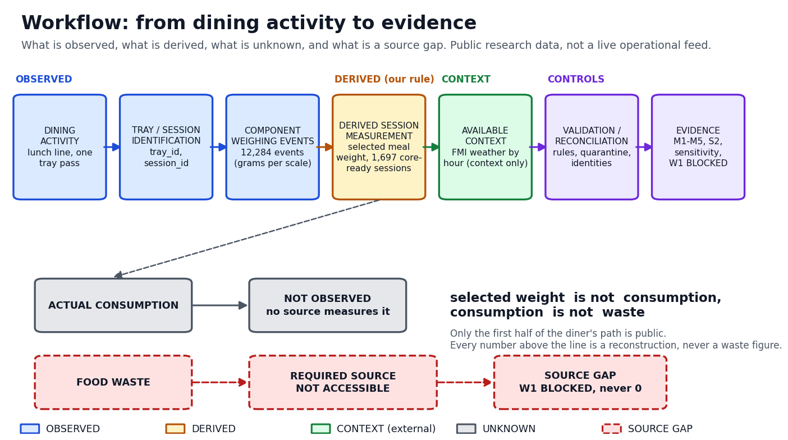
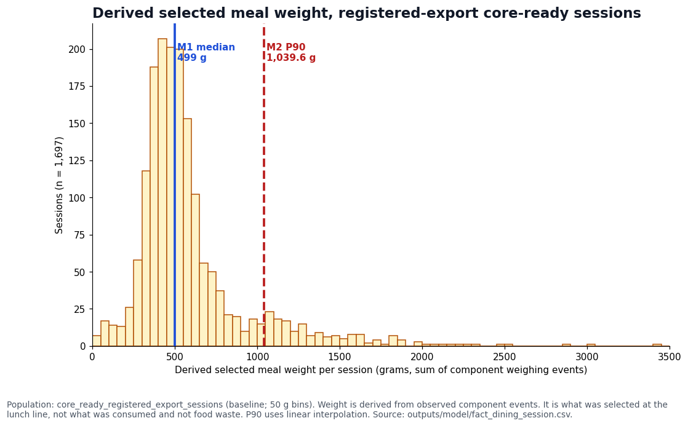
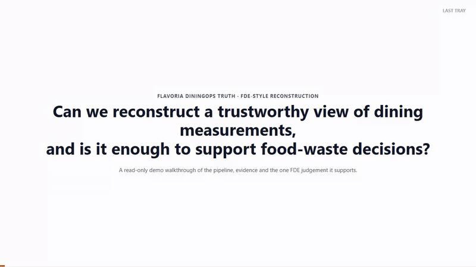

# LAST TRAY: Flavoria DiningOps Truth

*A data foundations project that traces what a lunch-line scale actually measures, and stays honest about the part it cannot measure: food waste.*

**If you only have five minutes:** start with [the problem](#1-problem), skim [the source map](#4-source-map) and [the numbers](#6-final-evidence), run [the pipeline](#11-pipeline), then read [the judgement call](#15-fde-judgement) and glance at the [demo](#16-demo).

## 1. Problem

This project is my submission for a data foundations course assignment that asks me to act as a Forward Deployed Engineer (FDE): take a business question, go find real data for it, and be honest about what that data can and cannot prove.

The scenario I picked is a self-service restaurant, Flavoria, that wants to cut food waste. In a real dining operation this kind of data usually sits in several separate systems: lunch-line scales, a checkout scale, waste stations, and weather, each owned by a different team with its own access rules. Leadership's working assumption is simple: since the lunch-line scales weigh every plate, waste should already be visible in the numbers. I wanted to actually test whether that assumption holds.

**Question.** Can I reconstruct a trustworthy view of dining measurements from the data that is actually available, and is that evidence enough to support a real food-waste decision?

| Aspect | Detail |
|---|---|
| **Who this is for** | the operations manager (what gets selected at the line), the kitchen manager (is the daily load stable), the sustainability lead (what data is still missing), and anyone checking whether this pipeline is solid enough to build on |
| **What I'm actually measuring** | the size and makeup of the selected meal, not a waste number. There is no waste KPI in this project, because the data to build one honestly does not exist yet |
| **What the output supports** | describing portions for the population I can measure, and making a specific, concrete case for what extra data would be needed before anyone commits to a waste-reduction program |

## 2. Scope and engagement framing

This is a simulated FDE-style reconstruction of a real dining-operations measurement problem, built entirely on publicly available Flavoria research data and public weather data. I have no access to any Flavoria system, and this project is not affiliated with or endorsed by the University of Turku, the University of Helsinki, Flavoria, or the Finnish Meteorological Institute. The restaurant scenario is invented for the assignment, but every file, number, and gap described here comes from real, public data (see `NOTICE`).

## 3. Key finding

Here is the short version. 12,284 component weighing events collect into 1,697 measurement-ready sessions, with a median derived selected meal weight of 499 g. That part is reproducible and I am confident in it.

But selected meal weight is not consumption, and consumption is not food waste. Nothing in the public data measures what happened after a tray left the scale. The one source that would answer that question, Flavoria's own waste documentation, exists but is not publicly accessible: its sample section literally reads "TODO, Ask!". So waste is a **SOURCE GAP** here, not a number, not an estimate, and not a guess dressed up as one.

## 4. Source map

| Source | What it is | What it gave me | Can it answer the waste question? |
|---|---|---|---|
| FlavoriaFoodWeight1700 (Zenodo, CC BY 4.0) | the actual dataset: one row per component weighing event, 11 CSV files, 2020-10-05 to 2020-11-20 | 12,284 weighing events, the backbone of everything in this project | no, it never claims to record consumption or waste |
| FMI open data weather API (CC BY 4.0) | hourly weather observations for Turku Artukainen | outdoor context only, joined to sessions by hour | no |
| Flavoria Data Catalog | a documentation page describing what systems exist | definitions of what each system is supposed to contain | no, it is documentation, not data |
| Flavoria Weigh & Dine documentation | describes a separate checkout-scale system | confirms a plate total exists elsewhere, but no public sample | no, and it measures something different anyway |
| Flavoria Lunch Line Waste documentation | describes a per-tray waste weighing system | this is the source that would actually answer the waste question, but its own sample section reads "TODO, Ask!" and nothing is downloadable | this is the one that matters, and it is not accessible |

I pulled data in two ways: downloading the Zenodo CSV archive as a file, and calling the FMI weather service as an API that returns XML. Before trusting anything downstream, I check that what I pulled matches what was promised: file size, MD5, SHA-256, and row counts (12,284 weighing events, 1,129 weather hours). Nothing in the raw files is edited after that; they sit untouched in the repository so the whole pipeline can run offline from a fresh clone.

## 5. Evidence model



| Status | What it means | In this project |
|---|---|---|
| **OBSERVED** | recorded by an instrument | 12,284 component weighing events; FMI weather hours |
| **DERIVED** | computed by me under a rule I chose and wrote down | sessions, `derived_selected_meal_weight_g`, readiness |
| **UNKNOWN** | never measured by anyone | how much was actually consumed |
| **SOURCE GAP** | it exists, but I cannot reach it | food waste (W1 BLOCKED) |

I modelled this at three levels: the raw weighing event, the derived session (every event that belongs to one tray pass), and the session component (each distinct item within a session), with weather and daily volume sitting alongside as context. Every validation problem I found gets logged to its own audit table instead of silently disappearing.

One thing that would have quietly broken this if I had not caught it: session IDs are not unique across the two exports in this dataset. Two session IDs, `session2266` and `session3222`, show up in both files. I did not just pick one and move on; both versions are kept and flagged so nobody downstream double counts them.

## 6. Final evidence

These numbers come straight from `outputs/metrics/metrics.csv`, which the pipeline regenerates every run. Population for M1 to M4 is the 1,697 core-ready registered-export sessions; population for M5 is the 1,699 eligible registered-export sessions.

| Metric | Name | Value | What it tells me | What it does NOT tell me |
|---|---|---:|---|---|
| M1 | Median Derived Selected Meal Weight | 499 g | the typical selected meal weight, summed from its components | intake. It is derived from what a scale recorded, not what a person ate |
| M2 | P90 Derived Selected Meal Weight | 1,039.6 g | the upper end of that distribution, 90th percentile | anything eaten; also the most sensitive of these numbers to which weeks I include |
| M3 | Observed Valid Sessions — Registered-Export Population | 1,697 | how many registered-export sessions were observed and passed validation | how many people came in. Volume follows a weekday pattern and six days break it |
| M4 | Median Distinct Normalized Components per Session | 5 | how many different named components a typical session picked | which dish it was, across days or exports. There is no name-matching table |
| M5 | Core Measurement Readiness | 99.88% (1,697 / 1,699) | the share of eligible sessions that meet my readiness bar | that the data has no problems. It is high mostly because few sessions carry an ERROR-level flag |

**Before you act on any of these numbers:** every figure above is a *selection* measurement. It is not consumption, and it is not food waste.

### Supporting evidence

| Metric | Name | Value | What it tells me | What it does NOT tell me |
|---|---|---:|---|---|
| S2 | Warn-Free Rate | 97.88% (1,663 / 1,699) | how many sessions carry no session-level warning | a data-quality score. A warning never removes a session from the numbers above |

### Source gap

| Metric | Name | Value | What it tells me | What it does NOT tell me |
|---|---|---:|---|---|
| W1 | Direct Food Waste Measurement | BLOCKED / SOURCE GAP | that no waste figure can be produced from the data I have access to | nothing about waste. No estimate, no band, no proxy |



I also broke the same measurement population down by physical scale (`python -m src.portioning_report`, written to `outputs/evidence/portioning_by_scale.csv`). It is a diagnostic, not a sixth metric, and it answers a question the table above cannot: which scale is portioning inconsistently. In this run, the highest flag rate belongs to `koti2-vasen-lammin2` at 0.55% of 182 events; most scales sit at 0%.

## 7. What we can conclude

- A selected-meal weight distribution can be reconstructed reproducibly, straight from the raw component weighing events.
- For the registered-export population, half of the measurement-ready sessions come in at 499 g or less, and one in ten go above 1,039.6 g.
- 99.88% of eligible sessions meet my readiness bar, and every number traces back to a checksummed raw file if anyone wants to check my work.
- Weather lines up for all 1,697 measurement-ready sessions, so that context is there if anyone wants to use it later.

## 8. What we cannot conclude

- How much food was actually eaten, left over, or thrown away. Nothing in this data measures that, and the one source that would is not accessible.
- Any waste-reduction number, saving, or impact figure. There is nothing here to calculate one from.
- That a session equals a person. It does not; a session is one tray pass through the line.
- Anything about other time periods, other capture systems, or the non-registered population, which I only ever use as a diagnostic, never pooled into the headline numbers.
- Any cause-and-effect claim about weather. It is context I can look at, not something I can say caused anything.

## 9. Data quality

Before trusting any of this, I profiled the raw files and found real problems. Seven of the eleven files are missing a column the others have. Rows are not in chronological order. One file's timestamps look shifted by exactly three hours compared to the matching session in the other export. Two session IDs show up in both exports at once. And in the first two weeks of the data, component names disagree between the two exports for a meaningful share of records.

I did not silently patch any of this. Every rule I apply has a defined severity and a defined treatment, and every quarantined record is listed, never deleted (`outputs/validation/quarantine_manifest.csv`). The two crossover sessions above are a good example: both versions stay in the data, flagged, so nobody downstream mistakes them for two different trays.

One more thing worth saying plainly: the labels "registered-export" and "non-registered-export" come from the file names themselves. Flavoria's own documentation never defines what those two categories actually mean, so I treat them only as labels, not as a business distinction I understand.

## 10. Sensitivity

Numbers are only trustworthy if I know how much they move when a judgement call changes. I tested 26 scenarios against my baseline and sorted the results into four buckets.

**Stable.** The median (stays between 493 and 505 g no matter what), the component count, the two crossover sessions, and the single largest weighing event.

**Sensitive.** The upper end of the distribution, M2 ranges from 977 to 1,066 g depending on the scenario, plus which weeks I include and six irregular-volume days.

**Conditional.** The valid session count and readiness depend on how I read the timestamp offset on one file. A plus-three-hour correction is my strongest-supported reading, not something the source confirms outright, though plus two, three, and four hours all agree with each other.

**Blocked.** Consumption and waste. No scenario I tried produces a number for either, because the data to compute one does not exist.

## 11. Pipeline

Everything above comes out of one command:

```
python -m src.pipeline.run --stages all      # same as: python -m src.pipeline.run
```

It runs six gated stages, ingest, stage, validate, model, metrics, sensitivity, in about ten seconds, and exits 0 if everything checks out. It is offline by design: it never reaches out to the network. If a raw file is missing, it fails immediately with exit code 4 and names the exact command to fetch it, `python -m src.pipeline.fetch --source <flavoria|weather>`. If any stage fails, every later stage is blocked and its stale outputs are removed rather than left around to confuse someone, and the exit code tells you which layer broke (4 source, 6 weather, 7 validation, 8 model, 9 metrics, 10 sensitivity, 11 orchestration).

`--config-dir`, `--out`, and `--repo-root` (plus `fetch`'s `--dest`) can also come from an environment variable instead of a flag, which is handy in a container or CI job. A flag you actually pass always wins over the environment variable.

Setup, run every command from the repository root, Python 3.11:

```
python -m venv .venv
.venv\Scripts\activate                 # Windows;  Linux/macOS: source .venv/bin/activate
pip install -r requirements.txt
python -m src.pipeline.run
python -m pytest
```

I also built two small, read-only tools that check the pipeline's own work instead of asking you to trust it blindly. Neither one changes a metric, and both are tested:

- `python -m src.sql_verify` rebuilds a real SQLite database from the canonical tables and recomputes M1 through M5 and the weather join in actual SQL, window functions included, then checks the result against `outputs/metrics/metrics.csv`.
- `python -m src.portioning_report` produces the per-scale breakdown described in section 6.

## 12. Reproducibility

Raw files are pinned by size, MD5, and SHA-256, and re-checked on every read of the pipeline, not just once. They are committed byte-exact into the repository (about 4 MB, CC BY 4.0), so a fresh clone can run the whole thing offline without downloading anything first.

Outputs are deterministic. I ran the pipeline twice, with different hash seeds and into different output directories, and got byte-identical files both times. `outputs/pipeline/` keeps a run manifest, a stage summary, and eleven pipeline controls that all have to pass.

I also cloned the repository fresh into an empty folder and reran everything from scratch. It reproduced every output and passed the full test suite, which is the bar I actually care about, not just "it works on my machine."

## 13. Repository structure

```
README.md         this file
config/            the decisions I locked in: sources and their checksums, thresholds, the timezone override, populations
data/raw/          the raw inputs, preserved exactly as downloaded
src/               ingest, stage, validate, model, metrics, sensitivity, and the pipeline that runs them in order
tests/             unit tests, real-data tests, failure-injection tests, and tests that check the documentation itself
outputs/           everything the pipeline generates: ingestion, staging, validation, model, metrics, evidence, pipeline records
docs/              the assignment writeup: source reasoning, decisions, evidence, sensitivity, the judgement call
diagrams/          source map, workflow, data model, pipeline, and distribution figures (PNG, plus the script that builds them)
research/          the exploration scripts that produced the numbers I cite as evidence
notebooks/         a read-only walkthrough of the pipeline's own committed outputs, for anyone grading this
```

If you want the full paper trail behind a claim in this README, here is where it lives: `docs/assignment_traceability.md` maps every graded area to its artifacts, `docs/source_map.md` and `docs/source_truth_decisions.md` cover sourcing in full, `docs/final_evidence.md` and `docs/sensitivity_analysis.md` cover the numbers, `docs/known_unknowns_assumptions_limitations.md` and `docs/judgement_call.md` cover what I am and am not claiming, and `docs/pipeline.md` covers how the pipeline itself is built. You should not need to open any of them to understand what I did and why; this README is meant to stand on its own.

## 14. Known / Unknown / Assumptions / Limitations

| Bucket | What's in it |
|---|---|
| **Known** | event-level weight exists (12,284 events); sessions reconstruct cleanly; weather lines up for every measurement-ready session; two session IDs are duplicated across exports and both are kept; a selected meal weight can be derived from summed components |
| **Unknown** | actual consumption; what was left on the tray; actual food waste; whether this public research capture reflects everyday operational behaviour |
| **Assumptions** | a plus-three-hour timestamp correction for one export file (my strongest-supported reading, not source-confirmed); population labels taken straight from file names, not a business definition; the session-reconstruction rule (events sharing a session ID within one export are one tray pass); the diagnostic thresholds used to flag unusual records |
| **Limitations** | the public waste detail is not accessible in a usable form; component names disagree across exports for part of the study window; the data covers five weekday weeks in late 2020, not an ongoing feed; the non-registered population has different capture characteristics and is never pooled into the headline numbers |

I isolated every assumption in its own config file or rule, on purpose, so that if one turns out to be wrong, fixing it does not mean rewriting the pipeline. Each one is also stress-tested in section 10 above.

## 15. FDE judgement

If someone asked me right now whether to commit to a food-waste program based on this evidence, my answer is no, not yet. What I built supports describing what gets selected at the lunch line, and it supports trusting that the pipeline itself is solid enough to build on. It does not support any claim about consumption or waste, because nothing in the accessible data measures either one.

The next thing worth spending effort on is not a smarter model or a proxy metric. It is getting hold of tray-linked waste records, a waste weight tied to the same tray identifier and a timestamp, from whatever system actually produces Flavoria's waste documentation. If that becomes available, the selected side and the waste side could finally be compared as two real observations instead of one measurement and one guess. Until then, treating selected weight as a stand-in for waste would mean presenting an assumption as if it were a result, and I would rather say plainly that I do not have the number than make one up.

## 16. Demo

A three to five minute walkthrough script is in `docs/demo_script.md`. I recorded myself following it: [`demo/last_tray_demo.webm`](demo/last_tray_demo.webm), silent with on-screen captions, generated straight from this repository's own committed outputs.



That is a 6x-speed, roughly 52 second preview of the full video above, just to show the shape of it without downloading the whole file. Watch the actual video for real pacing and the captions.

## Licence and attribution

- **My own code and documentation** here are released under the [MIT Licence](LICENSE).
- **The MIT Licence does not cover third-party data.** FlavoriaFoodWeight1700 (Zenodo, DOI 10.5281/zenodo.5850856) and the FMI weather observations stay under CC BY 4.0 and are attributed in [`NOTICE`](NOTICE). The raw files under `data/raw/` are redistributed exactly as I received them.
- This project is not affiliated with or endorsed by the data providers.
